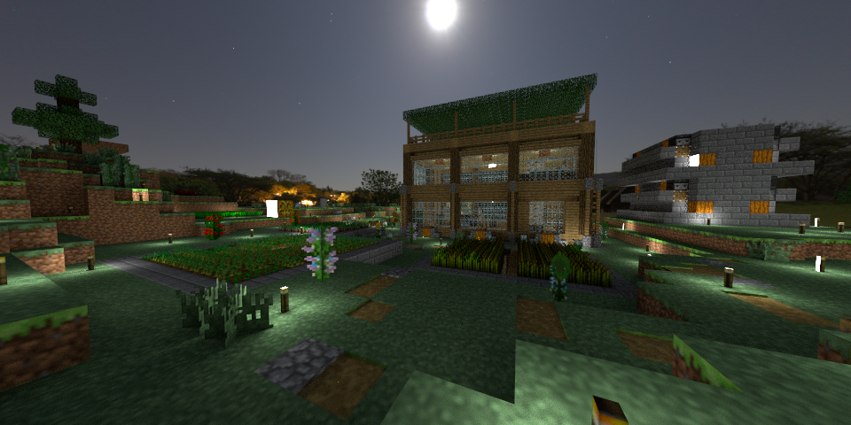

# mc2pbrt



This repo is a program that can output a pbrt file by current player pose.
To render a minecraft scene, it takes serveral steps.

* First, the config file should be setuped. See **Config**.
* Second, execute `realcam.py`.
* Third, use [pbrt-v3-minecraft](https://github.com/PbrtCraft/pbrt-v3-minecraft) to render pbrt file:
    `$ ./pbrt [path-to-mc2pbrt]/scenes/[pbrtfile].pbrt`

For client part, `realcam.py` will auto collect the resource of minecraft 1.13.2,
while for server part, the user need to download the resource pack and put files into right folders.

## Config

Example:

```
{
  "Samples" : 256,
  "Camera" : "Camera \"perspective\"",
  "World" : "Idea",
  "Player" : "Mudream",
  "EnvLight" : "env/aristea_wreck_4k.exr",
  "Method" : "path",
  "Radius" : 16,
  "Target" : "example.pbrt"
}
```

* Samples: Samples per pixel
* Camera: Pbrt camera name and parameter
* World: World name or path
* Player: Id of player
* EnvLight: Envirnment light map filename
* Method: Render method
* MethodArg: More setting about render method
* Radius: Render block radius
* Target: Output filename

## Folder

* block : The model json files should be here.
* scenes/block : Texture files should be here.
* scenes/env   : Current include 2 envirnment maps from [HavenHDRI](https://hdrihaven.com/hdris/)
